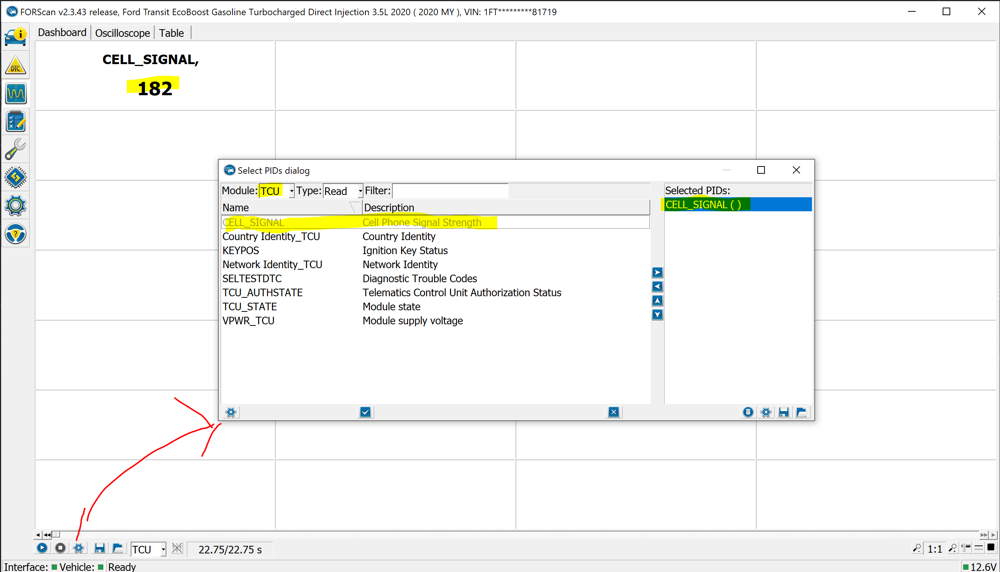

# van-hack

An attempt to hack a 2020 Ford Transit to do the following:

### 1. Display WiFi hotspot signal strength

More specifically, the mobile network signal strength of the modem.
The signal strength is displayed as bars in the "Connectivity Features" menu on the built in infotainment display, however this menu becomes de-activated while driving, thus making it (nearly) impossible to determine the signal strength while driving. If you do enter the "Connectivity Features" setting before moving the vehicle you can see the signal strength while moving, however, backing out of the menu, for instance, to change the radio station will lock out of the menu.

#### Forscan approach
Using the [Forscan](https://forscan.org/home.html) software for Windows and an [OBDLink EX](https://www.obdlink.com/products/obdlink-ex/) I was able to display the hotspot signal strength by using the Oscilloscope functionality and adding the CELL_SIGNAL PID from the TCU module (see screenshot below).

While this is progress in the right directly, I don't really want to rely on Forscan since it is closed source and does not allow live exporting of this data for integration with other programs.




### 2. Prevent the WiFi hotspot from turning off after 30 minutes

The WiFi hotspot will power off after 30 minutes in order to save power. This makes it difficult to use the wifi for extended periods of time without having to turn the engine on. This may not be completely solvable via software hack as auxilary power may be necessary to power the wifi hotspot (Telematics Control Unit - TCU).

### 3. Control the lights

The lights in the cargo area of the van do not turn off when the center console light switch is set to the off position. There is a button near the rear door that will shut off these lights. My theory is that this just sends a message over the CANbus. My goal is to learn what this message is and implement a new way to switch off the lights, via cell phone app and/or raspberry pi with a more conveniently located hardware switch/button.

## Ubuntu Can Bus
In order to determine which usb port the OBDLink EX has connected to, you can execute the following:
```commandline
$ sudo dmesg | grep usb

[ 2433.904419] usb 1-1: USB disconnect, device number 9
[ 2439.428839] usb 1-1: new full-speed USB device number 10 using xhci_hcd
[ 2439.588010] usb 1-1: New USB device found, idVendor=0403, idProduct=6015, bcdDevice=10.00
[ 2439.588022] usb 1-1: New USB device strings: Mfr=1, Product=2, SerialNumber=3
[ 2439.588028] usb 1-1: Product: OBDLink EX
[ 2439.588032] usb 1-1: Manufacturer: ScanTool.net LLC
[ 2439.588036] usb 1-1: SerialNumber: XXXXXXXXXXXX
[ 2439.592165] usb 1-1: Detected FT-X
[ 2439.593054] usb 1-1: FTDI USB Serial Device converter now attached to ttyUSB0

```